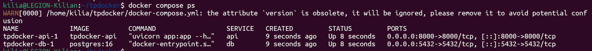
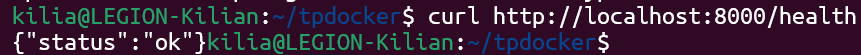
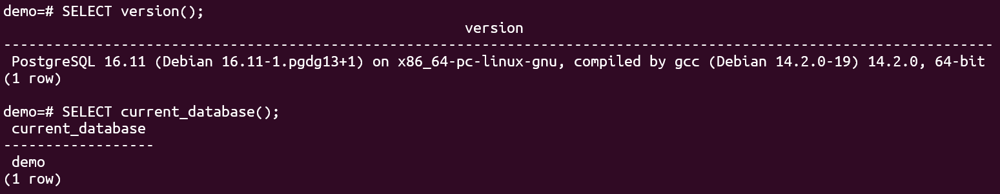
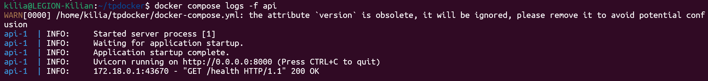
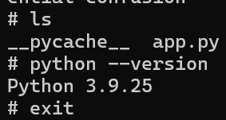
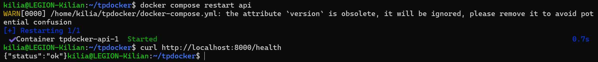
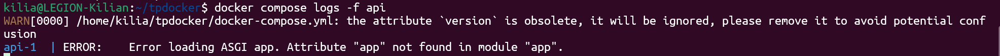

**TP 1 DOCKER**

**EXERCICE 1 : Installation de Docker et vérification de l’environnement**

Question 1.b.

Question 1.c. Listez maintenant les conteneurs présents sur votre machine (en cours d'exécution ou arrêtés) :
`docker ps -a`
Expliquez brièvement dans votre rapport ce que représente cette liste.

Dans le résultat obtenu :
- On voit le conteneur créé à partir de l'image `hello-world`.
- Son statut est `Exited (0)`, ce qui signifie qu'il a terminé sa tâche avec succès et s'est arrêté automatiquement juste après.
- Il possède un nom aléatoire (`vigorous_jemison`) car nous ne l'avons pas nommé manuellement.

**EXERCICE 2 : Premiers pas avec Docker : images et conteneurs**

Question 2.a. Expliquez en quelques phrases la différence entre une image Docker et un conteneur Docker. Cette réponse devra apparaître dans votre rapport final.

L'Image Docker est un modèle inerte (statique) qui contient tout le nécessaire pour faire fonctionner l'application (le code, les bibliothèques, les dépendances système), mais elle ne "tourne" pas. Elle est en lecture seule.

Le Conteneur Docker est l'instance en cours d'exécution (dynamique) de cette image. C'est un environnement isolé et vivant qui possède son propre système de fichiers temporaire. On peut lancer plusieurs conteneurs différents à partir d'une seule et même image.

Question 2.b. Exécutez un conteneur très léger basé sur l’image alpine et affichez un message dans la console :
`docker run alpine echo "Bonjour depuis un conteneur Alpine"`
Que se passe-t-il après l'exécution de cette commande ? Expliquez brièvement dans votre rapport.

Lors de l'exécution de la commande :
1. Téléchargement : Docker n'a pas trouvé l'image `alpine` localement (message `Unable to find image...`), il l'a donc téléchargée depuis le Docker Hub.
2. Exécution : Le conteneur a démarré, a exécuté la commande `echo "Bonjour..."`, et le message s'est affiché.
3. Arrêt immédiat : Juste après l'affichage, le conteneur s'est arrêté (Exited) car le processus principal été terminé. La commande `echo` étant à execution immédiate le conteneur s'arrête juste après.

Questio 2.c. Listez à nouveau les conteneurs présents sur votre machine :
`docker ps -a`
Vous devriez voir un conteneur alpine avec un statut Exited. Expliquez pourquoi dans votre rapport.

Le conteneur affiche le statut `Exited (0)` car son processus principal (la commande `echo`) s'est terminé.

Nous sommes donc dans le même état que pour le premier conteneur sauf qu'ici on retrouve la commande passé qui n'est pas la même et le nom donné qui n'est aussi pas le même.

Question 2.d. Lancez un conteneur interactif basé sur Alpine :
`docker run -it alpine sh`
À l’intérieur du conteneur, tapez les commandes suivantes :
`ls`
`uname -a`
`exit`
Indiquez dans votre rapport ce que vous observez.

L'option `-it` a permis d'ouvrir un terminal interactif à l'intérieur du conteneur.
Observations :
1. Système de fichiers (`ls`) : On voit l'arborescence spécifique de la distribution Alpine. C'est un système de fichiers isolé, différent de celui de ma machine hôte.
2. Noyau partagé (`uname -a`) : Le conteneur indique utiliser un noyau Linux "Microsoft-standard-WSL2". Cela prouve que le conteneur partage le noyau de la machine hôte (ici WSL) au lieu d'avoir son propre noyau comme le ferait une machine virtuelle.
3. Sortie (`exit`) : En quittant le shell, le processus principal s'arrête et le conteneur s'éteint.

**EXERCICE 3 : Construire une première image Docker avec une mini-API FastAPI**

Étape 1 — Compléter le fichier app.py

On vous fournit ci-dessous un squelette de fichier app.py avec quelques éléments manquants. Complétez les zones indiquées.

Question 3.a. Complétez le code afin que l’API expose une route /health qui renvoie un JSON {"status": "ok"}.

app.py
TODO: importer FastAPI
from fastapi import FastAPI

TODO: créer une instance FastAPI
app = FastAPI()

TODO: définir une route GET /health
@app.get("/health")
def health(): 
    return {"status": "ok"}

Étape 2 — Compléter le Dockerfile

Question 3.b. Complétez les lignes marquées # TODO.
Dockerfile

TODO: choisir une image de base Python
FROM python:3.9-slim

TODO: définir le répertoire de travail dans le conteneur
WORKDIR /app

TODO: copier le fichier app.py
COPY app.py .

Installer FastAPI et Uvicorn
RUN pip install fastapi uvicorn

TODO: lancer le serveur au démarrage du conteneur
CMD ["uvicorn", "app:app", "--host", "0.0.0.0", "--port", "8000"]

Étape 3 — Construire l'image Docker

Question 3.c. Construisez maintenant l’image Docker à partir du Dockerfile avec la commande suivante :
`docker build -t simple-api .`
Indiquez dans votre rapport que la construction s’est bien déroulée (capture d’écran recommandée).

Le processus s'est déroulé en 4 étapes principales (correspondant aux instructions du Dockerfile) :
1.  Récupération de l'image de base `python:3.9-slim`.
2.  Création du dossier de travail `/app`.
3.  Copie du code source `app.py`.
4.  Installation des dépendances (`fastapi`, `uvicorn`).

L'image finale a été nommée et taguée `simple-api:latest` avec succès.

**EXERCICE 4 : Exécuter l’API FastAPI dans un conteneur Docker**

Étape 1 — Lancer le conteneur

Question 4.a. Lancez un conteneur à partir de l’image simple-api en exposant le port 8000 du conteneur sur le port 8000 de votre machine. Utilisez la commande suivante :
`docker run -p 8000:8000 simple-api`

Expliquez dans votre rapport le rôle de l’option -p 8000:8000.

L'option `-p 8000:8000` sert à effectuer une redirection de port (port mapping) entre la machine hôte et le conteneur: 
- Le premier 8000 est le port sur ma machine (Host)
- Le second 8000 est le port interne du conteneur

Étape 2 — Tester l’endpoint /health

Question 4.b. Dans un autre terminal (ou via votre navigateur), appelez l’endpoint /health de l’API :
`curl http://localhost:8000/health`

ou bien en ouvrant http://localhost:8000/health dans un navigateur. Vérifiez que la réponse JSON correspond à ce qui était attendu.

Ajoutez une capture d’écran de la réponse dans votre rapport.

Retour ok

Étape 3 — Observer les conteneurs en cours d’exécution

Question 4.c. Dans un autre terminal, affichez la liste des conteneurs en cours d’exécution :
`docker ps`

Identifiez la ligne correspondant au conteneur simple-api et notez dans votre rapport :
- le nom du conteneur : angry_euclid
- l'image utilisée : simple-api
- le port mappé : 0.0.0.0:8000->8000/tcp

Étape 4 — Arrêter le conteneur

Question 4.d. Arrêtez le conteneur en cours d’exécution depuis un autre terminal à l’aide de la commande :
`docker stop <nom_ou_id_du_conteneur>`

Puis vérifiez qu’il n’apparaît plus dans docker ps, mais qu’il est toujours visible dans docker ps -a. Expliquez brièvement la différence entre ces deux commandes dans votre rapport.

Après avoir exécuté `docker stop`, le conteneur n'apparaît plus dans `docker ps` mais reste visible dans `docker ps -a`.

Différence entre les commandes :
- `docker ps` : Ne liste que les conteneurs actifs (en cours d'exécution). Comme notre conteneur est arrêté, il n'y figure plus.
- `docker ps -a` (pour "all") : Liste tous les conteneurs existants sur la machine, quel que soit leur état (en cours d'exécution, arrêtés, ou en erreur).

**EXERCICE 5 : Démarrer un mini-système multi-conteneurs avec Docker Compose**

Étape 1 — Préparer la structure des fichiers

Ok

Étape 2 — Compléter le fichier docker-compose.yml

Question 5.b. Complétez le fichier docker-compose.yml ci-dessous.

version: "3.9"

services:
  db:
    image: postgres:16
    environment:
      # TODO: définir l'utilisateur, le mot de passe et le nom de la base
      POSTGRES_USER: demo
      POSTGRES_PASSWORD: demo
      POSTGRES_DB: demo
    ports:
      # TODO: exposer le port PostgreSQL vers l'hôte
      - "5432:5432"

  api:
    # TODO: construire l'image à partir du Dockerfile dans ./api
    build: ./api
    ports:
      # TODO: exposer le port 8000 du conteneur vers l'hôte
      - "8000:8000"
    depends_on:
      # TODO: indiquer que l'API dépend de la base de données
      - db

Étape 3 — Démarrer la stack avec Docker Compose

Question 5.c. À la racine de votre projet (là où se trouve docker-compose.yml), lancez les services en arrière-plan :
`docker compose up -d`

Puis affichez la liste des services gérés par Docker Compose :
`docker compose ps`

Vérifiez dans votre rapport que les services db et api sont bien démarrés (capture d’écran recommandée).

Tout est ok

Étape 4 — Tester à nouveau l’endpoint /health

Question 5.d. Vérifiez que l’endpoint /health de l’API est toujours accessible, cette fois-ci lorsque l’API est lancée via Docker Compose :
`curl http://localhost:8000/health`

ou via votre navigateur. Ajoutez une capture d’écran dans votre rapport.

Toujours ok

Étape 5 — Arrêter proprement les services

Question 5.e. Lorsque vous avez terminé, arrêtez et supprimez les conteneurs gérés par Docker Compose :
`docker compose down`

Expliquez dans votre rapport la différence entre :
- Arrêter les services avec docker compose down ;
- Arrêter un conteneur individuel avec docker stop <id>.

`docker compose down` : Cette commande agit sur l'ensemble de la stack définie dans le fichier YAML. Elle effectue un nettoyage complet :
    1. Arrête tous les services (API et Base de données).
    2. Supprime les conteneurs (ils disparaissent totalement, même de `docker ps -a`).
    3. Supprime le réseau virtuel associé (ici `tpdocker_default`).

`docker stop <id>` : Cette commande cible un conteneur unique. Elle se contente d'arrêter son exécution (le processus s'éteint), mais le conteneur existe toujours (visible dans `docker ps -a`).

**EXERCICE 6 : Interagir avec la base de données PostgreSQL dans un conteneur**

Étape 1 — Se connecter au conteneur PostgreSQL

Question 6.a. Utilisez la commande suivante pour ouvrir un shell psql à l’intérieur du conteneur PostgreSQL :
`docker compose exec db psql -U demo -d demo`

Expliquez dans votre rapport le rôle de chaque option (exec, db, -U, -d).

- `exec` : Cette commande Docker Compose permet d'exécuter une commande à l'intérieur d'un conteneur déjà en cours d'exécution.
- `db` : C'est le nom du service défini dans le fichier `docker-compose.yml`. Docker Compose se charge de retrouver le conteneur associé (ici `tpdocker-db-1`).
- `-U demo` : C'est une option de la commande `psql`. Elle spécifie l'utilisateur (User) avec lequel on souhaite se connecter (ici "demo").
- `-d demo` : C'est une option de la commande `psql`. Elle indique le nom de la base de données (Database) à laquelle se connecter (ici "demo").

Étape 2 — Exécuter quelques commandes SQL simples

Question 6.b. Une fois connecté à psql, exécutez les commandes suivantes :
`SELECT version();`
Puis :
`SELECT current_database();`

Notez dans votre rapport les résultats obtenus, et ajoutez une capture d’écran de la session psql.

Version : `SELECT version();`
- Résultat : `PostgreSQL 16.11 (Debian 16.11-1.pgdg13+1)...`
- Cela confirme que le serveur PostgreSQL tourne bien sous la version 16, basée sur une image Debian.

Base courante : `SELECT current_database();`
- Résultat : `demo`
- Cela confirme que je suis bien connecté à la base de données nommée "demo", comme défini dans le fichier `docker-compose.yml`.

Étape 3 — Comprendre la connexion depuis d'autres services

Question 6.c. Dans votre rapport, expliquez comment un autre service Docker (par exemple l’API) pourrait se connecter à la base de données PostgreSQL. Précisez :
- le hostname à utiliser : db
- le port : 5432
- l’utilisateur et le mot de passe : demo
- le nom de la base : demo

Exemple de connexion : `postgresql://demo:demo@db:5432/demo`

Étape 4 — Nettoyer

Question 6.d. Après vos tests, vous pouvez arrêter la stack :
`docker compose down`

Si vous souhaitez également supprimer les volumes associés (données persistantes), vous pouvez utiliser :
`docker compose down -v`

Expliquez dans votre rapport la conséquence de l’option -v.

L'option `-v` demande à Docker de supprimer également les volumes de stockage associés au projet.

Conséquence :
C'est une action destructive. Si j'utilise cette option, toutes les données stockées dans la base de données (tables, utilisateurs, enregistrements) sont définitivement effacées.

**EXERCICE 7 : Déboguer des conteneurs Docker : commandes essentielles et bonnes pratiques**

Étape 1 — Afficher les logs d’un service

Question 7.a. Affichez en continu les logs du service api exécuté par Docker Compose :
`docker compose logs -f api`

Relevez dans votre rapport ce que vous observez lorsque :
- l’API démarre correctement ;
- l’API reçoit une requête /health.

On remarque bien le bon demarrage de l'API ainsi que le get fait avec le curl http://localhost:8000/health dans un autre terminal via la commande de logs.

Étape 2 — Entrer dans un conteneur en cours d’exécution

Question 7.b. Utilisez la commande ci-dessous pour ouvrir un shell sh dans le conteneur de l’API :
`docker compose exec api sh`

À l’intérieur du conteneur :
`ls`
`python --version`
`exit`
Expliquez dans votre rapport ce que vous observez.

La commande `docker compose exec api sh` a permis d'ouvrir un terminal interactif à l'intérieur du conteneur API pendant qu'il tourne.

Observations :
Contenu du dossier (`ls`) :
- On retrouve le fichier `app.py`.
- Cela confirme que l'instruction `COPY app.py .` du Dockerfile a bien fonctionné et que nous sommes bien situés dans le répertoire de travail `/app` (défini par `WORKDIR`).

Version de Python (`python --version`) :
- Le système retourne `Python 3.9.25`.
- Cela confirme que le conteneur utilise bien l'image de base `python:3.9-slim` que nous avons spécifiée dans le `Dockerfile`.

Étape 3 — Redémarrer un service

Question 7.c. Redémarrez seulement le service api à l’aide de la commande suivante :
`docker compose restart api`

Vérifiez qu’après redémarrage, l’API est toujours accessible sur /health Expliquez dans votre rapport dans quelles situations un redémarrage est utile.

Le redémarrage est utile dans plusieurs situations critiques :
- Application bloquée ou bug : Si l'application ne répond plus ou a consommé trop de mémoire, un redémarrage permet de repartir sur un état propre.
- Perte de connexion : Si la base de données a redémarré, l'API peut avoir perdu sa connexion. La redémarrer force une nouvelle tentative de connexion.
- Mise à jour de configuration : Si on modifie des variables d'environnement dans le `docker-compose.yml`, un simple redémarrage suffit parfois pour qu'elles soient prises en compte.

Toujours ok.

Étape 4 — Conteneur qui ne démarre pas : diagnostic

Question 7.d. Simulez un problème en introduisant volontairement une erreur dans votre fichier app.py (par exemple renommer app en appi), puis reconstruisez l’image :
`docker build -t simple-api .`

Relancez Docker Compose :
`docker compose up -d --build`

Observez les logs :
`docker compose logs -f api`

Expliquez dans votre rapport comment vous avez identifié la cause de l’erreur.

Suite à la modification volontaire du code (renommage de l'instance `app` en `appi`), le conteneur a refusé de démarrer correctement.

Identification de la cause via les logs :
La commande `docker compose logs -f api` a affiché le message critique suivant :
`ERROR:    Error loading ASGI app. Attribute "app" not found in module "app".`

Analyse technique :
Ce message s'explique par la commande de démarrage définie dans notre Dockerfile :
`CMD ["uvicorn", "app:app", ...]`

Cette syntaxe `app:app` signifie :
- Chercher un fichier nommé `app.py` (le module).
- Chercher à l'intérieur une variable/instance nommée `app`.

Comme j'ai renommé la variable en `appi` dans le code Python, Uvicorn ne trouve plus l'objet `app` attendu et arrête le processus, ce qui provoque le crash du conteneur.

Étape 5 — Supprimer des conteneurs et images

Questioin 7.e. Supprimez tous les conteneurs arrêtés :
`docker container prune`

Supprimez toutes les images inutilisées :
`docker image prune`

Expliquez dans votre rapport pourquoi il est utile de nettoyer régulièrement son environnement Docker.

Il est utile de nettoyer régulièrement son environnement Docker pour plusieurs raisons :
- Libérer de l'espace disque : Les images Docker (surtout celles de Python ou de bases de données) pèsent souvent plusieurs centaines de Méga-octets. À chaque fois qu'on reconstruit une image (avec `docker build`), l'ancienne version devient "orpheline" (dangling) et continue d'occuper de l'espace inutilement. Le nettoyage permet de récupérer parfois plusieurs Gigaoctets.
- Maintenir la clarté opérationnelle : Accumuler des dizaines de conteneurs arrêtés (statut `Exited`) pollue la sortie de la commande `docker ps -a`, rendant difficile la surveillance des services réellement importants.

**EXERCICE 8 : Questions de réflexion et consignes pour le rendu**

Question 8.a. Expliquez pourquoi un notebook Jupyter n’est généralement pas adapté pour déployer un modèle de Machine Learning en production. Votre réponse doit faire référence à au moins deux aspects vus durant ce TP (ex : reproductibilité, environnement, automatisation...).

Un Jupyter Notebook est un outil très bien pour l'exploration de données et le prototypage, mais il n'est pas adapté au déploiement d'un modèle en production pour plusieurs raisons observées durant ce TP :
- L'isolation de l'environnement (Reproductibilité) : Dans un Notebook, on dépend des bibliothèques installées sur la machine locale. Si on change d'ordinateur, le code risque de ne plus marcher. À l'inverse, dans ce TP, nous avons utilisé un Dockerfile pour figer une version précise de Python (`3.9-slim`) et des dépendances exactes. L'image Docker garantit que le code s'exécutera exactement de la même manière partout.
- L'automatisation du démarrage : Un Notebook nécessite souvent qu'un humain exécute les cellules dans un ordre précis. À l'inverse, dans ce TP, l'instruction `CMD` du Dockerfile permet à l'application de démarrer automatiquement dès le lancement du conteneur, ce qui est indispensable pour un serveur redémarrant seul après une panne.

Question 8.b. Expliquez pourquoi Docker Compose est un outil essentiel lorsque l’on manipule plusieurs services (API, base de données...). Référencez au moins un avantage observé lors du TP.

Docker Compose est essentiel dès que l'architecture dépasse un seul conteneur (ex: API + Base de données), comme observé dans l'exercice 5.

Avantage majeur observé : La gestion automatique du réseau.
Sans Docker Compose, nous aurions dû :
1. Créer un réseau manuellement (`docker network create`).
2. Lancer la base de données en la rattachant à ce réseau.
3. Lancer l'API en la rattachant au même réseau et en gérant les variables d'environnement à la main.

Avec Docker Compose, tout cela a été géré par un seul fichier (`docker-compose.yml`) et une seule commande (`docker compose up`). De plus, la résolution DNS interne a permis à l'API de contacter la base de données simplement en utilisant son nom de service (`db`), sans avoir à gérer les adresses IP.