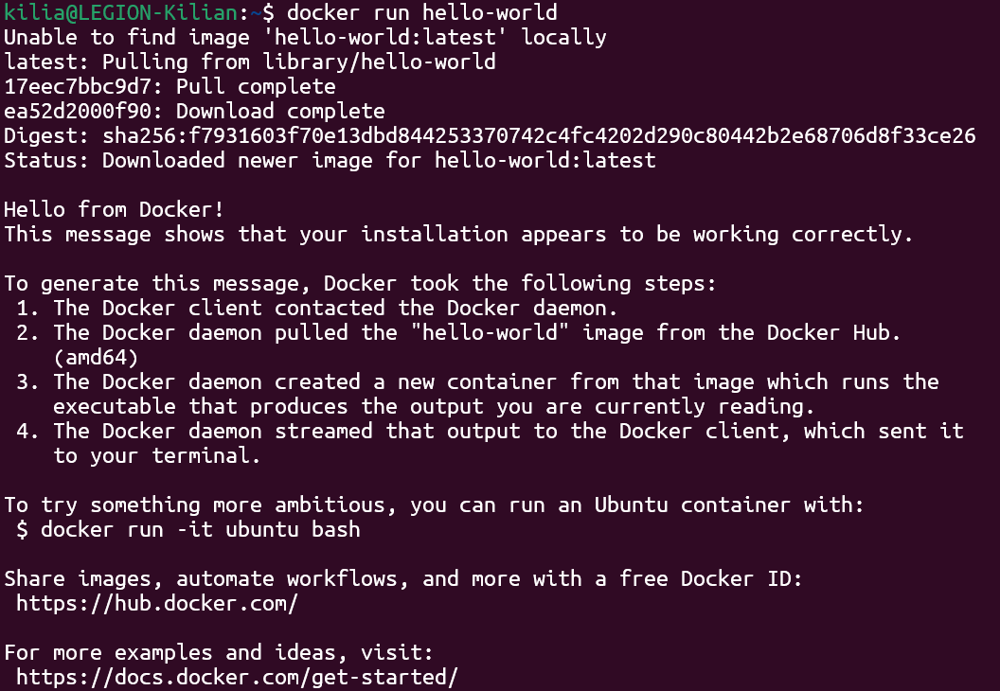

**TP 1 DOCKER**

**EXERCICE 1 : Installation de Docker et vérification de l’environnement**

Question 1.b.

Question 1.c. Listez maintenant les conteneurs présents sur votre machine (en cours d'exécution ou arrêtés) et expliquez brièvement dans votre rapport ce que représente cette liste.

Dans le résultat obtenu :
- On voit le conteneur créé à partir de l'image `hello-world`.
- Son statut est `Exited (0)`, ce qui signifie qu'il a terminé sa tâche avec succès et s'est arrêté automatiquement juste après.
- Il possède un nom aléatoire (`vigorous_jemison`) car nous ne l'avons pas nommé manuellement.

**EXERCICE 2 : Premiers pas avec Docker : images et conteneurs**

Question 2.a. Expliquez en quelques phrases la différence entre une image Docker et un conteneur Docker. Cette réponse devra apparaître dans votre rapport final.

L'Image Docker est un modèle inerte (statique) qui contient tout le nécessaire pour faire fonctionner l'application (le code, les bibliothèques, les dépendances système), mais elle ne "tourne" pas. Elle est en lecture seule.

Le Conteneur Docker est l'instance en cours d'exécution (dynamique) de cette image. C'est un environnement isolé et vivant qui possède son propre système de fichiers temporaire. On peut lancer plusieurs conteneurs différents à partir d'une seule et même image.

Question 2.b. Exécutez un conteneur très léger basé sur l’image alpine et affichez un message dans la console :
docker run alpine echo "Bonjour depuis un conteneur Alpine"
Que se passe-t-il après l'exécution de cette commande ? Expliquez brièvement dans votre rapport.

