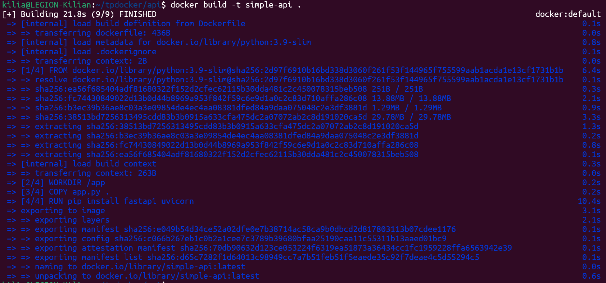
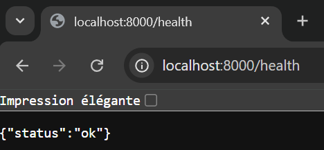

**TP 1 DOCKER**

**EXERCICE 1 : Installation de Docker et vérification de l’environnement**

Question 1.b.

Question 1.c. Listez maintenant les conteneurs présents sur votre machine (en cours d'exécution ou arrêtés) :
`docker ps -a`
Expliquez brièvement dans votre rapport ce que représente cette liste.

Dans le résultat obtenu :
- On voit le conteneur créé à partir de l'image `hello-world`.
- Son statut est `Exited (0)`, ce qui signifie qu'il a terminé sa tâche avec succès et s'est arrêté automatiquement juste après.
- Il possède un nom aléatoire (`vigorous_jemison`) car nous ne l'avons pas nommé manuellement.

**EXERCICE 2 : Premiers pas avec Docker : images et conteneurs**

Question 2.a. Expliquez en quelques phrases la différence entre une image Docker et un conteneur Docker. Cette réponse devra apparaître dans votre rapport final.

L'Image Docker est un modèle inerte (statique) qui contient tout le nécessaire pour faire fonctionner l'application (le code, les bibliothèques, les dépendances système), mais elle ne "tourne" pas. Elle est en lecture seule.

Le Conteneur Docker est l'instance en cours d'exécution (dynamique) de cette image. C'est un environnement isolé et vivant qui possède son propre système de fichiers temporaire. On peut lancer plusieurs conteneurs différents à partir d'une seule et même image.

Question 2.b. Exécutez un conteneur très léger basé sur l’image alpine et affichez un message dans la console :
`docker run alpine echo "Bonjour depuis un conteneur Alpine"`
Que se passe-t-il après l'exécution de cette commande ? Expliquez brièvement dans votre rapport.

Lors de l'exécution de la commande :
1. Téléchargement : Docker n'a pas trouvé l'image `alpine` localement (message `Unable to find image...`), il l'a donc téléchargée depuis le Docker Hub.
2. Exécution : Le conteneur a démarré, a exécuté la commande `echo "Bonjour..."`, et le message s'est affiché.
3. Arrêt immédiat : Juste après l'affichage, le conteneur s'est arrêté (Exited) car le processus principal été terminé. La commande `echo` étant à execution immédiate le conteneur s'arrête juste après.

Questio 2.c. Listez à nouveau les conteneurs présents sur votre machine :
`docker ps -a`
Vous devriez voir un conteneur alpine avec un statut Exited. Expliquez pourquoi dans votre rapport.

Le conteneur affiche le statut `Exited (0)` car son processus principal (la commande `echo`) s'est terminé.

Nous sommes donc dans le même état que pour le premier conteneur sauf qu'ici on retrouve la commande passé qui n'est pas la même et le nom donné qui n'est aussi pas le même.

Question 2.d. Lancez un conteneur interactif basé sur Alpine :
`docker run -it alpine sh`
À l’intérieur du conteneur, tapez les commandes suivantes :
`ls`
`uname -a`
`exit`
Indiquez dans votre rapport ce que vous observez.

L'option `-it` a permis d'ouvrir un terminal interactif à l'intérieur du conteneur.
Observations :
1. Système de fichiers (`ls`) : On voit l'arborescence spécifique de la distribution Alpine. C'est un système de fichiers isolé, différent de celui de ma machine hôte.
2. Noyau partagé (`uname -a`) : Le conteneur indique utiliser un noyau Linux "Microsoft-standard-WSL2". Cela prouve que le conteneur partage le noyau de la machine hôte (ici WSL) au lieu d'avoir son propre noyau comme le ferait une machine virtuelle.
3. Sortie (`exit`) : En quittant le shell, le processus principal s'arrête et le conteneur s'éteint.

**EXERCICE 3 : Construire une première image Docker avec une mini-API FastAPI**

Étape 1 — Compléter le fichier app.py

On vous fournit ci-dessous un squelette de fichier app.py avec quelques éléments manquants. Complétez les zones indiquées.

Question 3.a. Complétez le code afin que l’API expose une route /health qui renvoie un JSON {"status": "ok"}.

app.py
TODO: importer FastAPI
from fastapi import FastAPI

TODO: créer une instance FastAPI
app = FastAPI()

TODO: définir une route GET /health
@app.get("/health")
def health(): 
    return {"status": "ok"}

Étape 2 — Compléter le Dockerfile

Question 3.b. Complétez les lignes marquées # TODO.
Dockerfile

TODO: choisir une image de base Python
FROM python:3.9-slim

TODO: définir le répertoire de travail dans le conteneur
WORKDIR /app

TODO: copier le fichier app.py
COPY app.py .

Installer FastAPI et Uvicorn
RUN pip install fastapi uvicorn

TODO: lancer le serveur au démarrage du conteneur
CMD ["uvicorn", "app:app", "--host", "0.0.0.0", "--port", "8000"]

Étape 3 — Construire l'image Docker

Question 3.c. Construisez maintenant l’image Docker à partir du Dockerfile avec la commande suivante :
`docker build -t simple-api .`
Indiquez dans votre rapport que la construction s’est bien déroulée (capture d’écran recommandée).

Le processus s'est déroulé en 4 étapes principales (correspondant aux instructions du Dockerfile) :
1.  Récupération de l'image de base `python:3.9-slim`.
2.  Création du dossier de travail `/app`.
3.  Copie du code source `app.py`.
4.  Installation des dépendances (`fastapi`, `uvicorn`).

L'image finale a été nommée et taguée `simple-api:latest` avec succès.

**EXERCICE 4 : Exécuter l’API FastAPI dans un conteneur Docker**

Étape 1 — Lancer le conteneur

Question 4.a. Lancez un conteneur à partir de l’image simple-api en exposant le port 8000 du conteneur sur le port 8000 de votre machine. Utilisez la commande suivante :
`docker run -p 8000:8000 simple-api`

Expliquez dans votre rapport le rôle de l’option -p 8000:8000.

L'option `-p 8000:8000` sert à effectuer une redirection de port (port mapping) entre la machine hôte et le conteneur: 
- Le premier 8000 est le port sur ma machine (Host)
- Le second 8000 est le port interne du conteneur

Étape 2 — Tester l’endpoint /health

Question 4.b. Dans un autre terminal (ou via votre navigateur), appelez l’endpoint /health de l’API :
`curl http://localhost:8000/health`

ou bien en ouvrant http://localhost:8000/health dans un navigateur. Vérifiez que la réponse JSON correspond à ce qui était attendu.

Ajoutez une capture d’écran de la réponse dans votre rapport.

