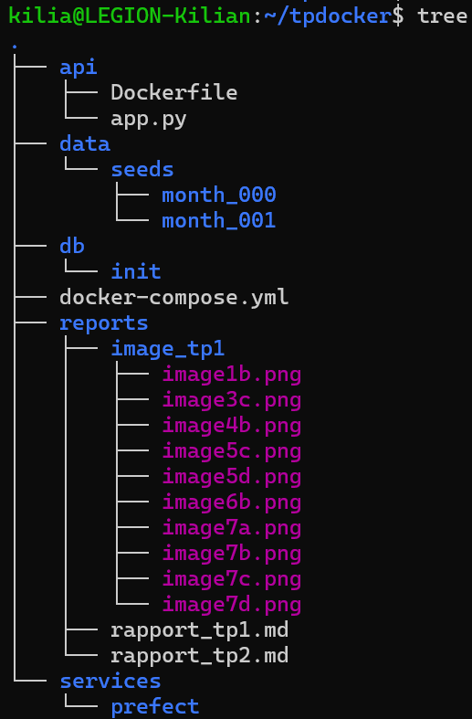
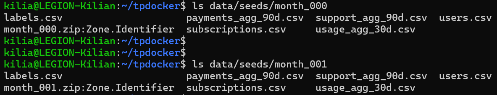
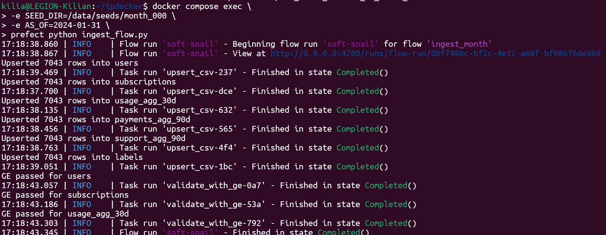

**EXERCICE 1 : Mise en place du projet et du rapport**

kilia@LEGION-Kilian:~/tpdocker$ git status
On branch main
Your branch is up to date with 'origin/main'.

Untracked files:
  (use "git add <file>..." to include in what will be committed)
        reports/rapport_tp2.md

nothing added to commit but untracked files present (use "git add" to track)

Question 1.b. Créer la structure minimale pour le TP2

Question 1.c. Télécharger et extraire les données month_000 et month_001

**EXERCICE 2 : Base de données et docker-compose**

Question 2.a. Créer le schéma de base de données dans db/init/001_schema.sql

Schéma ok

Question 2.b. Créer et comprendre le fichier .env

Le fichier `.env` sert à stocker les variables d'environnement (comme les mots de passe, les noms d'utilisateurs ou les ports) de manière centralisée.
Dans un projet Docker, il permet à Docker Compose d'injecter automatiquement ces valeurs dans la configuration des conteneurs, évitant ainsi d'écrire des secrets "en dur" dans le fichier `docker-compose.yml` ou dans le code source.

Question 2.c. Mettre à jour docker-compose.yml

services:
  postgres:
    image: postgres:16
    env_file: .env          # Utiliser les variables définies dans .env
    volumes:
      - ./db/init:/docker-entrypoint-initdb.d   # Monter les scripts d'init
      - pgdata:/var/lib/postgresql/data
    ports:
      - "5432:5432"

  prefect:
    build: ./services/prefect
    depends_on:
      - postgres
    env_file: .env          # Réutiliser les mêmes identifiants Postgres
    environment:
      PREFECT_API_URL: http://0.0.0.0:4200/api
      PREFECT_UI_URL: http://0.0.0.0:4200
      PREFECT_LOGGING_LEVEL: INFO
      POSTGRES_HOST: postgres
      POSTGRES_PORT: 5432
      POSTGRES_USER: ${POSTGRES_USER}
      POSTGRES_PASSWORD: ${POSTGRES_PASSWORD}
      POSTGRES_DB: ${POSTGRES_DB}
    volumes:
      - ./services/prefect:/opt/prefect/flows
      - ./data:/data:ro     # Rendre les CSV accessibles au conteneur Prefect

volumes:
  pgdata:

Question 2.d. Démarrer Postgres et vérifier les tables créées

streamflow=# \dt
               List of relations
 Schema |       Name       | Type  |   Owner
--------+------------------+-------+------------
 public | labels           | table | streamflow
 public | payments_agg_90d | table | streamflow
 public | subscriptions    | table | streamflow
 public | support_agg_90d  | table | streamflow
 public | usage_agg_30d    | table | streamflow
 public | users            | table | streamflow
(6 rows)

Description des tables :
- labels : Contient la variable cible (target) indiquant si l'utilisateur a résilié son abonnement (churn_label).
- payments_agg_90d : Historise les incidents de paiement (échecs) survenus au cours des 90 derniers jours.
- subscriptions : Recense les caractéristiques de l'abonnement (types de plans, facturation, ancienneté) et les montants financiers associés.
- support_agg_90d : Résume les interactions avec le support client (nombre de tickets, temps de résolution) sur 90 jours.
- usage_agg_30d : Agrège les métriques d'utilisation technique et comportementale sur 30 jours (heures de visionnage, appareils, problèmes de buffering).
- users : Contient les données sociodémographiques des clients (genre, séniorité, situation familiale) et leur date d'inscription.

**EXERCICE 3 : Upsert des CSV avec Prefect (month_000)**

Question 3.a. Créer le service Prefect : services/prefect/Dockerfile et services/prefect/requirements.txt

Le conteneur Prefect joue le rôle d'orchestrateur dans notre architecture Data. Son rôle est de planifier, déclencher et surveiller l'exécution des pipelines d'ingestion de données (les "Flows"). Il garantit que les tâches s'exécutent dans le bon ordre (ex: attendre que la base soit prête avant d'insérer des données), gère les reprises automatiques en cas d'échec (retries) et fournit une interface visuelle pour monitorer l'état de santé du système.

Question 3.b. Créer le fichier services/prefect/ingest_flow.py (version TP)

La fonction upsert_csv explique comment le code garantit que l'importation peut être relancée plusieurs fois sans créer de doublons (idempotence).

Question 3.c. Lancer Prefect et l’ingestion de month_000

kilia@LEGION-Kilian:~/tpdocker$ docker compose exec postgres psql -U streamflow -d streamflow
psql (16.11 (Debian 16.11-1.pgdg13+1))
Type "help" for help.

streamflow=# SELECT COUNT(*) FROM users;
 count
-------
  7043
(1 row)

streamflow=#
streamflow=# SELECT COUNT(*) FROM subscriptions;
 count
-------
  7043
(1 row)

Combien de clients avons-nous après month_000 ? : 7043

**EXERCICE 4 : Validation des données avec Great Expectations**

Question 4.a. Compléter la fonction validate_with_ge

La fonction `validate_with_ge` agit comme un garde-fou de qualité des données (Quality Gate). Elle est exécutée immédiatement après l'ingestion (upsert) et avant toute utilisation ultérieure des données (comme les snapshots). Son rôle est de vérifier que les données ingérées respectent des règles métier strictes (schéma exact, pas de valeurs négatives, pas de valeurs nulles critiques). Si une validation échoue, le pipeline s'arrête immédiatement (fail-fast), empêchant ainsi des données corrompues de se propager dans le système de Machine Learning.

Question 4.b. Relancer l’ingestion pour month_000 avec validation

Question 4.c. Compléter le rapport : pourquoi ces bornes et comment protègent-elles le modèle ?

Validation des données :

- Code des expectations pour usage_agg_30d :

Vérification de la cohérence des données (valeurs positives)
gdf.expect_column_values_to_be_between("watch_hours_30d", min_value=0)
gdf.expect_column_values_to_be_between("avg_session_mins_7d", min_value=0)

- Justification des bornes choisies :
J'ai choisi une borne inférieure (min_value=0) pour les colonnes watch_hours_30d (heures de visionnage) et avg_session_mins_7d (durée moyenne de session) car le temps ne peut pas être négatif.
Une valeur négative dans ces champs est physiquement impossible et indique nécessairement une erreur technique en amont (bug dans le calcul de l'agrégat, problème de logs, soustraction inversée).

- Protection du modèle de Machine Learning :
Ces règles agissent comme un bouclier pour le modèle :
    - Stabilité mathématique : Certains algorithmes ou transformations de features (comme le passage au logarithme log(x) souvent utilisé pour normaliser des durées) provoqueraient des erreurs (crash) si on leur fournissait des nombres négatifs.
    - Intégrité statistique : Si le modèle s'entraîne sur des données contenant des valeurs aberrantes (ex: -999 heures), il va apprendre des corrélations fausses ("Bruit"). En production, cela conduirait à des prédictions de désabonnement (Churn) totalement erronées ("Garbage In, Garbage Out").

**EXERCICE 5 : Snapshots et ingestion month_001**

