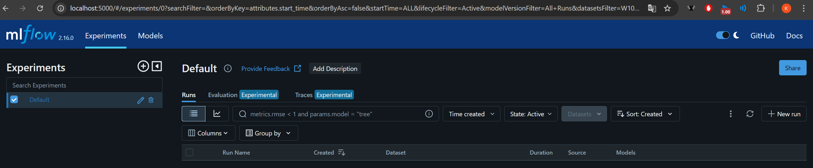
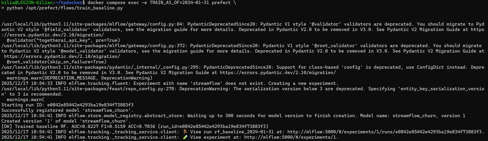
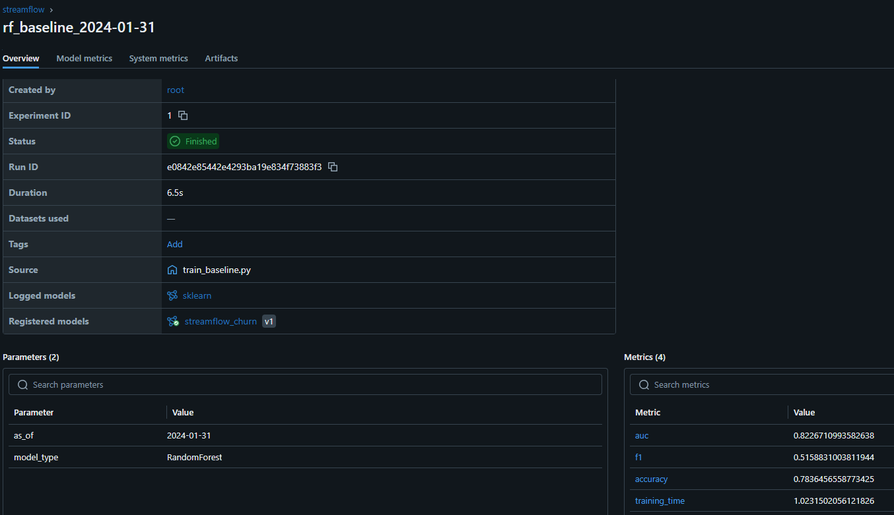
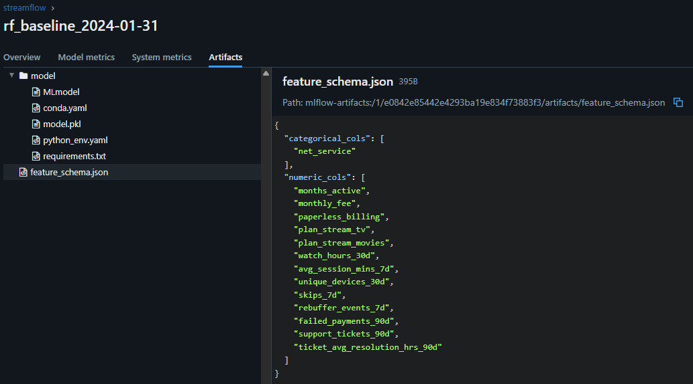
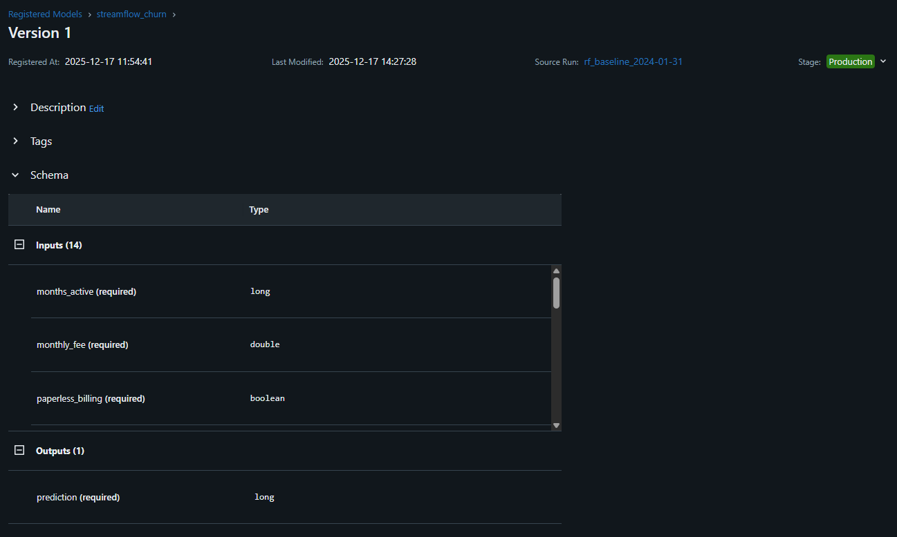
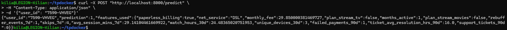
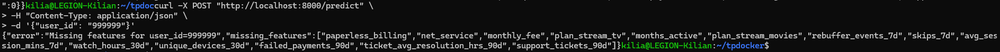

**EXERCICE 1 : Mise en route + rappel de contexte (sanity checks + où on en est dans la pipeline)**

Question 1.e. Dans votre rapport reports/rapport_tp4.md, listez :
1. les commandes utilisées,

Relancer les services pour commencer le TP :
docker compose up --build

Relancer les services pour prise en compte de MLflow dans docker-compose.yml :
docker compose up -d --build

Check des features toujours accessible :
curl http://localhost:8000/features/7590-VHVEG

2. une preuve que chaque service est accessible (captures ou sortie terminal),

Services ok :

kilia@LEGION-Kilian:~/tpdocker$ docker compose ps

NAME                  IMAGE              COMMAND                  SERVICE    CREATED      STATUS         PORTS
tpdocker-api-1        tpdocker-api       "uvicorn app:app --h…"   api        4 days ago   Up 3 minutes   0.0.0.0:8000->8000/tcp, [::]:8000->8000/tcp
tpdocker-feast-1      tpdocker-feast     "bash -lc 'tail -f /…"   feast      4 days ago   Up 3 minutes
tpdocker-postgres-1   postgres:16        "docker-entrypoint.s…"   postgres   5 days ago   Up 3 minutes   0.0.0.0:5432->5432/tcp, [::]:5432->5432/tcp
tpdocker-prefect-1    tpdocker-prefect   "/usr/bin/tini -g --…"   prefect    4 days ago   Up 8 seconds

MLflow :

Check feature ok :
kilia@LEGION-Kilian:~/tpdocker$ curl http://localhost:8000/features/7590-VHVEG
{"user_id":"7590-VHVEG","features":{"user_id":"7590-VHVEG","monthly_fee":29.850000381469727,"months_active":1,"paperless_billing":true}}

3. un court paragraphe : “quels composants tournent et pourquoi”.
- PostgreSQL : Sert de stockage persistant pour les données brutes et les snapshots historiques.
- Prefect : Orchestre et supervise l'exécution des pipelines d'ingestion et de validation de données.
- Feast : Assure la gestion unifiée des features, garantissant la cohérence entre l'entraînement (Offline) et la production (Online).
- API (FastAPI) : Expose les données (et bientôt les prédictions) via des endpoints HTTP pour les applications clientes.
- MLflow : Centralise le suivi des expériences (tracking) et gère le registre des modèles pour le déploiement.

**EXERCICE 2 : Créer un script d’entraînement + tracking MLflow (baseline RandomForest)**

Question 2.a. Créez le fichier services/prefect/train_baseline.py et copiez le squelette ci-dessous. Complétez
ensuite les zones marquées par _______ (ce sont vos TODO).

Pour répondre au TODO 9 il faut utiliser `pipe` (le pipeline complet) et non seulement `clf` (le classifieur RandomForest) car le modèle RandomForest ne sait traiter que des données numériques. Or, nos données brutes contiennent des variables catégorielles. Le Pipeline (`pipe`) contient l'étape de pré-traitement (`ColumnTransformer` + `OneHotEncoder`) qui transforme le texte en chiffres, puis le classifieur. En enregistrant le pipeline entier, nous garantissons que le modèle en production sera capable d'accepter des données brutes et de les transformer lui-même. C'est le principe d'un artefact autonome (self-contained).

Question 2.b. Exécutez votre script train_baseline.py dans le conteneur prefect sur month_000 avec

Question 2.c. Dans votre rapport reports/rapport_tp4.md, indiquez :

Suite à l'exécution du script `train_baseline.py`, voici les détails de l'expérience enregistrée :

1.  Date de référence (AS_OF) : `2024-01-31`
2.  Taille du dataset : 7043 lignes
3.  Colonnes catégorielles détectées : `['net_service']`
4.  Métriques de performance :
        - AUC : 0.8227
        - F1-score : 0.5159
        - Accuracy : 0.7836
        - Temps d'entraînement : 1.0232 s (visible dans l'UI MLflow).

Question 2.d. Toujours dans le rapport, expliquez en 5–8 lignes pourquoi on fixe :
- AS_OF et
- random_state

On fixe ces paramètres afin d'isoler les causes de variation des performances :
- `AS_OF` (Reproductibilité des Données) : Il fige l'état temporel du dataset. Sans lui, ré-exécuter le script demain inclurait de nouvelles données ou des modifications, rendant impossible la comparaison équitable avec une version précédente du modèle. Cela garantit que le dataset d'entrée est constant.
- `random_state` (Reproductibilité de l'Algorithme) : Il fige l'aléatoire des calculs (split train/val, échantillonnage du Random Forest). Sans lui, deux exécutions successives sur les mêmes données produiraient des métriques différentes juste par "chance".

**EXERCICE 3 : Explorer l’interface MLflow et promouvoir un modèle**

Question 3.f. Dans votre rapport reports/rapport_tp4.md, incluez :
- une capture de l’UI MLflow montrant le run (métriques + artefacts),

Run + métrique :

Artefacts :

- une capture du Model Registry avec le modèle en Production,

- le numéro de version promu.

Version 1

Question 3.g. Expliquez en 5–8 lignes pourquoi la promotion via une interface (stages None, Staging, Production) est
préférable à un déploiement manuel basé sur des fichiers ou des chemins locaux.

L'utilisation de "Stages" (Staging, Production) dans un Model Registry est préférable à la gestion manuelle de fichiers pour trois raisons majeures :
1.  Découplage Code/Modèle : L'application (API) est configurée pour charger `models:/streamflow_churn/Production`. Pour mettre à jour le modèle, il suffit de changer l'étiquette dans MLflow sans avoir à modifier le code de l'API ni redéployer des conteneurs.
2.  Gouvernance et Sécurité : Cela crée une source de vérité unique. On évite les erreurs humaines liées aux fichiers locaux ambigus (ex: `model_v2_final_vrai.pkl`) et on sait exactement qui a promu quelle version et quand.
3.  Rollback instantané : En cas d'incident en production, on peut rétrograder la version via l'interface en quelques secondes, sans intervention technique lourde sur les serveurs.

**EXERCICE 4 : Étendre l’API pour exposer /predict (serving minimal end-to-end)**

Question 4.f. Dans votre rapport reports/rapport_tp4.md, incluez :
- une requête réussie (capture Swagger ou commande curl),

kilia@LEGION-Kilian:~/tpdocker$ curl -X POST "http://localhost:8000/predict" \
> -H "Content-Type: application/json" \
> -d '{"user_id": "7590-VHVEG"}'

- la réponse JSON obtenue

{"user_id":"7590-VHVEG","prediction":1,"features_used":{"paperless_billing":true,"net_service":"DSL","monthly_fee":29.850000381469727,"plan_stream_tv":false,"months_active":1,"plan_stream_movies":false,"rebuffer_events_7d":1,"skips_7d":4,"avg_session_mins_7d":29.14104461669922,"watch_hours_30d":24.48365020751953,"unique_devices_30d":3,"failed_payments_90d":1,"ticket_avg_resolution_hrs_90d":16.0,"support_tickets_90d":0}}

Question 4.g. Dans votre rapport, expliquez en 5–8 lignes pourquoi le modèle chargé par l’API doit pointer vers models:/streamflow_churn/Production et pas vers un fichier local (.pkl) ou un artifact de run.

Pointer vers l'URI `models:/streamflow_churn/Production` permet de découpler le cycle de vie du modèle du code de l'application. Si nous utilisions un fichier `.pkl` local ou un ID de run spécifique, chaque mise à jour du modèle nécessiterait de modifier le code de l'API et de redéployer l'image Docker. Avec l'alias "Production", l'API n'en sait rien de la version exacte : les Data Scientists peuvent promouvoir une nouvelle version (v2, v3...) via l'interface MLflow, et l'API chargera automatiquement ce nouveau modèle au prochain démarrage (ou rechargement), garantissant fluidité et gouvernance.

**EXERCICE 5 : Robustesse du serving : cas d’échec réalistes (sans monitoring)**

Question 5.c. Dans votre rapport reports/rapport_tp4.md, fournissez :
- un exemple de requête qui réussit (commande/capture) + la réponse JSON,

- un exemple de requête qui échoue (commande/capture) + la réponse JSON d’erreur (avec missing_features),

- un court paragraphe “ce qui peut mal tourner en serving et comment on le détecte tôt”. Dans ce paragraphe, discutez au minimum ces deux causes (sans refaire Feast) :
     - Entité absente : le user_id demandé n’est pas présent dans l’online store : L'ID demandé (ex: 999999) n'existe pas dans le Feature Store (nouveau client ou erreur de saisie). Feast renvoie des None, ce qui ferait crasher le modèle mathématique sans vérification préalable.
     - Online store incomplet / obsolète : la matérialisation est manquante ou n’est pas à jour (stale), ce qui se traduit par des valeurs manquantes côté API : Si le job de matérialisation (feast materialize) tombe en panne ou a du retard (latence), les données pour un utilisateur existant peuvent être manquantes dans Redis/Postgres Online. L'API se retrouve "aveugle" et doit refuser de prédire plutôt que de fournir une prédiction aléatoire basée sur des vides.

**EXERCICE 6 : Réflexion de synthèse (ingénierie MLOps)**

Question 6.a. Expliquez ce que MLflow garantit dans cette pipeline :
- au niveau de la traçabilité des entraînements,
- au niveau de l’identification des modèles servis.

Traçabilité des entraînements :
1. Contrairement à des prints dans la console, MLflow a historisé chaque exécution de train_baseline.py avec :
    - Le contexte des données : Le paramètre as_of loggé permet de lier une performance modèle (AUC) à un état précis de la base de
    données (Snapshot du 31 Janvier).
    - Les artefacts : Le fichier feature_schema.json et le modèle sérialisé (pipeline complet) sont stockés ensemble, garantissant qu'on peut reproduire ou inspecter exactement ce qui a été produit ce jour-là.

2. Identification des modèles servis : Le Model Registry agit comme une source de vérité unique.
    - Il remplace les noms de fichiers hasardeux (ex: model_final_v2.pkl) par une version stricte (Version 1, Version 2).
    - L'utilisation de l'alias "Production" et de l'URI models:/streamflow_churn/Production garantit que l'API ne charge jamais un modèle expérimental par erreur. C'est MLflow qui fait l'aiguillage, permettant de changer le modèle actif sans redéployer le code de l'API.

Question 6.b. Expliquez ce que signifie concrètement le stage Production pour l’API :
- comment le modèle est sélectionné au démarrage,
- ce que cela permet (ou empêche) côté déploiement.

Sélection au démarrage :
1. Lorsque l'API démarre et exécute mlflow.pyfunc.load_model("models:/streamflow_churn/Production"), elle interroge le registre pour savoir "Quelle est la version actuelle étiquetée Production ?". MLflow résout ce lien symbolique vers la version physique (ex: Version 1) et sert les fichiers correspondants. L'API n'a donc jamais besoin de connaître le numéro de version exact en dur dans son code.

2. Impact sur le déploiement :
    - Ce que cela permet : La mise à jour du modèle "à chaud" ou par simple redémarrage, sans toucher au code de l'API ni reconstruire l'image Docker. Si la Version 2 est promue en Production via l'UI, l'API la chargera automatiquement au prochain démarrage.
    - Ce que cela empêche : L'exposition accidentelle de modèles non validés. L'API étant configurée strictement sur le canal "Production", elle ignorera mécaniquement tout modèle en "Staging" ou sans stage, protégeant les utilisateurs finaux des expérimentations des Data Scientists.

Question 6.c. Identifiez au moins trois points où la reproductibilité peut encore casser dans ce système, même avec
MLflow (exemples : données, code, configuration, environnement).

1. Code non versionné (Git) : MLflow trace les paramètres, mais si l'entraînement est lancé depuis un code local contenant des modifications non commitées, il sera impossible de retrouver le code exact ayant produit le modèle.

2. Environnement instable (Dépendances) : Si le requirements.txt n'épingle pas strictement toutes les versions (ex: pandas au lieu de pandas==2.0.3), une reconstruction de l'image Docker dans 6 mois pourrait installer des versions plus récentes, modifiant subtilement les résultats ou cassant le code (j'ai eu le cas avec le module de BigDATA en revenant plus tard et en relançant mon notebook des nouvelles versions de Spark, nottament, s'étaient installées cassant la suite du code...)

3. Intégrité des sources de données : Le paramètre as_of repose sur la fiabilité des tables de snapshots. Si les données sources (CSV) sont modifiées rétroactivement ou si le pipeline d'ingestion (Upsert) change de logique, les snapshots futurs pour la même date pourraient différer de ceux utilisés initialement.