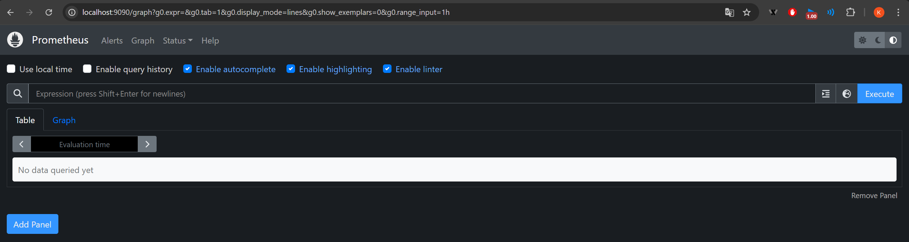
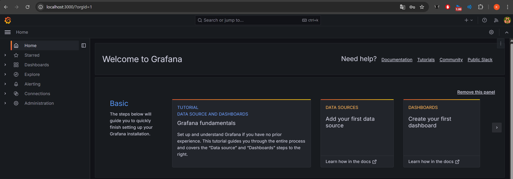
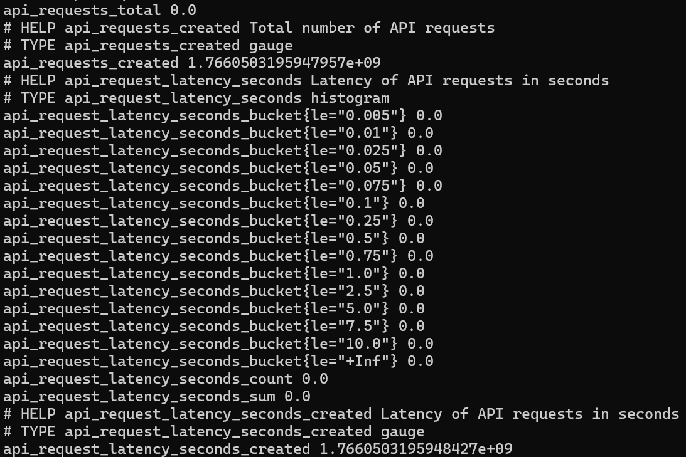
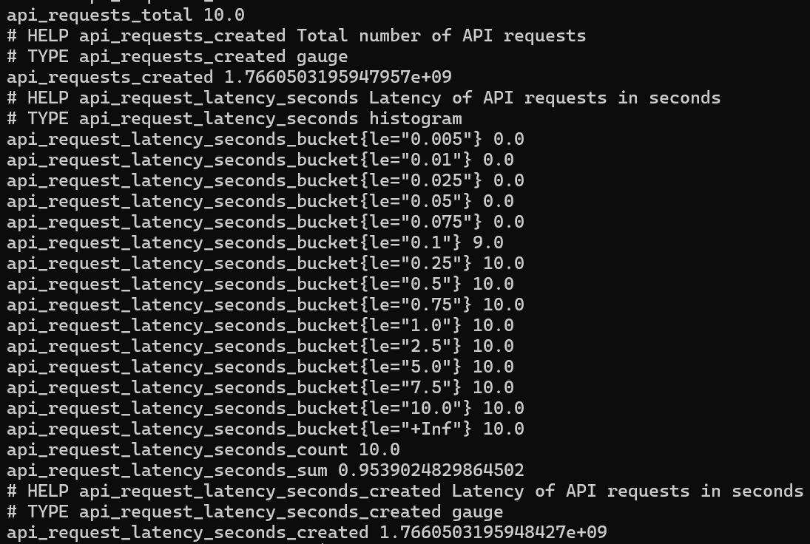
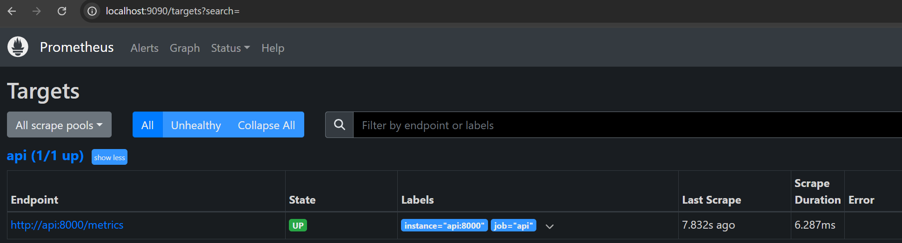
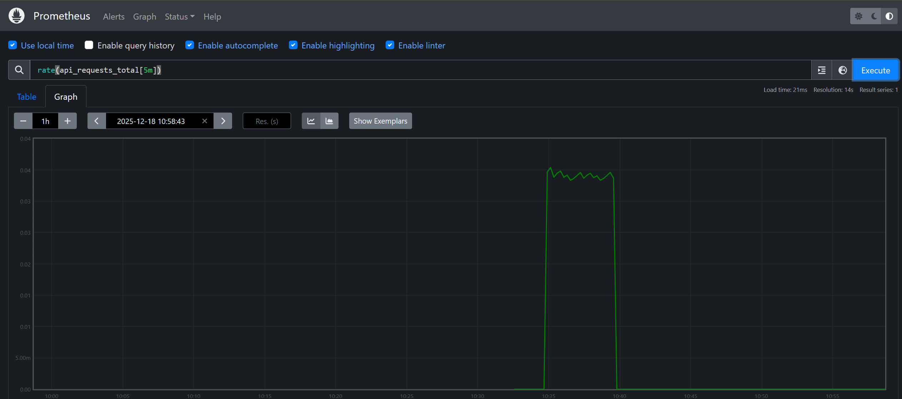

**EXERICE 1 : Démarrer la stack pour l'observabilité**

Question 1.e. Identifiez aussi les noms de conteneurs (via docker compose ps) et expliquez en une phrase pourquoi Prometheus utilise api:8000 au lieu de localhost:8000.

kilia@LEGION-Kilian:~/tpdocker$ docker compose ps
NAME                    IMAGE                           COMMAND                  SERVICE      CREATED         STATUS         PORTS
streamflow-grafana      grafana/grafana:11.2.0          "/run.sh"                grafana      7 minutes ago   Up 7 minutes   0.0.0.0:3000->3000/tcp, [::]:3000->3000/tcp
streamflow-prometheus   prom/prometheus:v2.55.1         "/bin/prometheus --c…"   prometheus   7 minutes ago   Up 7 minutes   0.0.0.0:9090->9090/tcp, [::]:9090->9090/tcp
tpdocker-api-1          tpdocker-api                    "uvicorn app:app --h…"   api          19 hours ago    Up 7 minutes   0.0.0.0:8000->8000/tcp, [::]:8000->8000/tcp
tpdocker-feast-1        tpdocker-feast                  "bash -lc 'tail -f /…"   feast        19 hours ago    Up 7 minutes
tpdocker-mlflow-1       ghcr.io/mlflow/mlflow:v2.16.0   "mlflow server --bac…"   mlflow       22 hours ago    Up 7 minutes   0.0.0.0:5000->5000/tcp, [::]:5000->5000/tcp
tpdocker-postgres-1     postgres:16                     "docker-entrypoint.s…"   postgres     19 hours ago    Up 7 minutes   0.0.0.0:5432->5432/tcp, [::]:5432->5432/tcp
tpdocker-prefect-1      tpdocker-prefect                "/usr/bin/tini -g --…"   prefect      7 minutes ago   Up 3 seconds

Prometheus utilise l'adresse api:8000 au lieu de localhost:8000 car, à l'intérieur d'un réseau Docker Compose :
- localhost désigne le conteneur lui-même (donc le conteneur Prometheus).
- api est le nom du service défini dans docker-compose.yml, qui est résolu automatiquement par le DNS interne de Docker vers l'adresse IP du conteneur de l'API. C'est le seul moyen pour un conteneur d'en contacter un autre par son nom.

Question 1.f.  Dans votre rapport reports/rapport_tp5.md, ajoutez :
- Un court transcript terminal montrant docker compose up -d et/ou docker compose ps.

kilia@LEGION-Kilian:~/tpdocker$ docker compose ps
NAME                    IMAGE                           COMMAND                  SERVICE      CREATED         STATUS         PORTS
streamflow-grafana      grafana/grafana:11.2.0          "/run.sh"                grafana      7 minutes ago   Up 7 minutes   0.0.0.0:3000->3000/tcp, [::]:3000->3000/tcp
streamflow-prometheus   prom/prometheus:v2.55.1         "/bin/prometheus --c…"   prometheus   7 minutes ago   Up 7 minutes   0.0.0.0:9090->9090/tcp, [::]:9090->9090/tcp
tpdocker-api-1          tpdocker-api                    "uvicorn app:app --h…"   api          19 hours ago    Up 7 minutes   0.0.0.0:8000->8000/tcp, [::]:8000->8000/tcp
tpdocker-feast-1        tpdocker-feast                  "bash -lc 'tail -f /…"   feast        19 hours ago    Up 7 minutes
tpdocker-mlflow-1       ghcr.io/mlflow/mlflow:v2.16.0   "mlflow server --bac…"   mlflow       22 hours ago    Up 7 minutes   0.0.0.0:5000->5000/tcp, [::]:5000->5000/tcp
tpdocker-postgres-1     postgres:16                     "docker-entrypoint.s…"   postgres     19 hours ago    Up 7 minutes   0.0.0.0:5432->5432/tcp, [::]:5432->5432/tcp
tpdocker-prefect-1      tpdocker-prefect                "/usr/bin/tini -g --…"   prefect      7 minutes ago   Up 3 seconds

- Une capture d’écran de la page d’accueil Prometheus.

- Une capture d’écran de l’écran de login ou d’accueil Grafana.

**EXERCICE 2 : Instrumentation de FastAPI avec de métriques Prometheus**

Question 2.c.  Dans votre rapport reports/rapport_tp5.md, ajoutez :

- ne capture d’écran (ou un court extrait copié/collé) de /metrics montrant vos deux métriques et au moins une ligne.

Metric origine :

Metric après quelques /predict :

- Une explication en 3–5 lignes : pourquoi un histogramme est plus utile qu’une simple moyenne de latence.

La moyenne écrase les valeurs extrêmes et peut masquer des problèmes graves (ex: 1% des requêtes prenant 10s n'affectent que très peu la moyenne). L'histogramme permet de calculer des percentiles (P95, P99) pour comprendre la distribution réelle et garantir que le service est rapide pour la grande majorité des utilisateurs, pas seulement "en moyenne".

**EXERCICE 3 : Exploration de Prometheus (Targets, Scrapes, PromQL)**

Question 3.b. Dans Prometheus, ouvrez l’onglet Graph (ou la barre de requête sur la page d’accueil) et exécutez les requêtes suivantes. Pour chacune, observez le résultat (valeur ou courbe) et interprétez brièvement ce que cela signifie.
- up : résultat = 1 / Cette métrique binaire indique la santé de la cible. `1` signifie que le scraping fonctionne (le service est en ligne et accessible), `0` signifierait qu'il est inaccessible.

- api_requests_total : Un nombre entier croissant ou direct pour ma part car j'ai direct fait un test en lançant 10 fois le /predict / C'est un compteur absolu (monotone croissant). Il représente le nombre total de requêtes reçues par l'API depuis son dernier démarrage. Il ne diminue jamais (sauf redémarrage).

- rate(api_requests_total[5m]) : Une courbe ou une valeur décimale (environ 0.034 pour ma part). / C'est le débit (RPS - Requests Per Second). La fonction `rate()` calcule la dérivée du compteur sur une fenêtre glissante de 5 minutes. C'est l'indicateur clé pour connaître la charge instantanée du serveur (trafic).

Question 3.c. Affichez une vue simple de la latence basée sur l’histogramme. Exécutez cette requête et observez comment elle évolue lorsque vous générez du trafic :
- rate(api_request_latency_seconds_sum[5m]) / rate(api_request_latency_seconds_count[5m])

Expliquez en une phrase ce que représente cette valeur.

Cette formule calcule la latence moyenne des requêtes sur la fenêtre de 5 minutes (en divisant la somme totale du temps passé par le nombre total de requêtes sur cette période).

Question 3.d. Dans votre rapport reports/rapport_tp5.md, ajoutez :
- Une capture d’écran de la page Status → Targets montrant la target de l’API en UP.

- Une capture d’écran d’un graphe Prometheus correspondant à une requête PromQL (par exemple rate(api_requests_total[5m])).

Exemple courbe pour rate(api_requests_total[5m]) :

