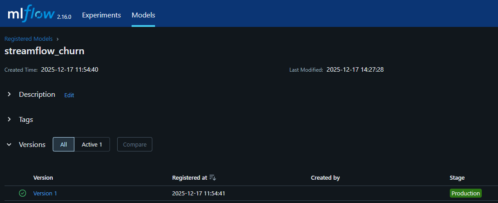
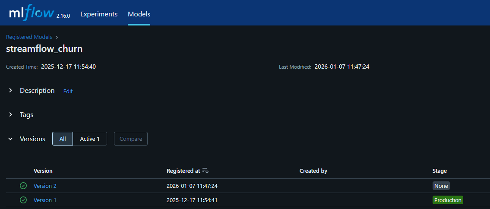
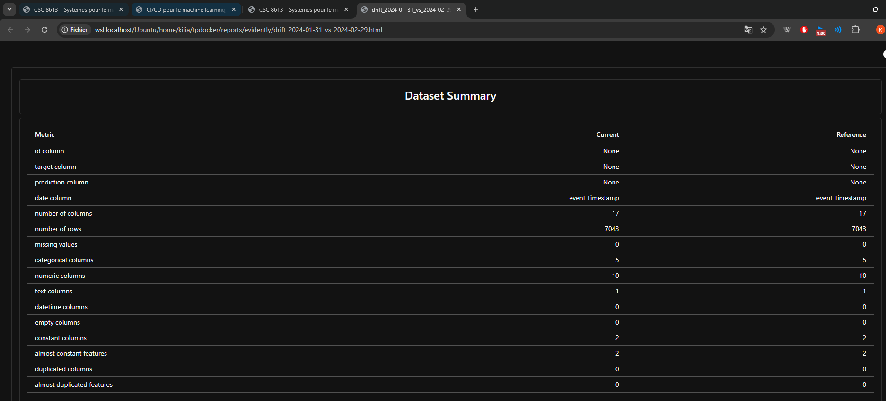
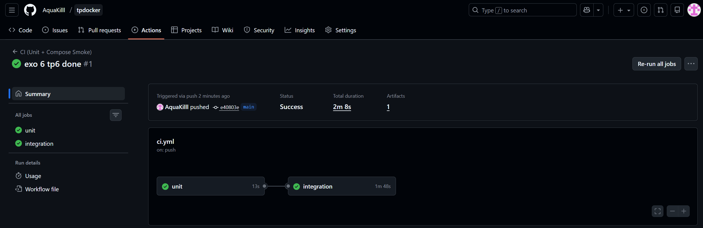

**EXERCICE 1 : Mise en place du rapport et vérifications de départ**

Question 1.d. Dans votre rapport, ajoutez :
Un transcript terminal montrant docker compose up -d et docker compose ps

kilia@LEGION-Kilian:~/tpdocker$ docker compose up -d
WARN[0000] Found orphan containers ([tpdocker-db-1]) for this project. If you removed or renamed this service in your compose file, you can run this command with the --remove-orphans flag to clean it up.
[+] Running 7/7
 ✔ Container tpdocker-mlflow-1      Started                                                                        0.9s
 ✔ Container tpdocker-postgres-1    Started                                                                        0.9s
 ✔ Container tpdocker-feast-1       Started                                                                        0.4s
 ✔ Container tpdocker-prefect-1     Started                                                                        0.4s
 ✔ Container tpdocker-api-1         Started                                                                        0.4s
 ✔ Container streamflow-prometheus  Started                                                                        0.4s
 ✔ Container streamflow-grafana     Started                                                                        0.5s

kilia@LEGION-Kilian:~/tpdocker$ docker compose ps
NAME                    IMAGE                           COMMAND                  SERVICE      CREATED       STATUS         PORTS
streamflow-grafana      grafana/grafana:11.2.0          "/run.sh"                grafana      2 weeks ago   Up 3 minutes   0.0.0.0:3000->3000/tcp, [::]:3000->3000/tcp
streamflow-prometheus   prom/prometheus:v2.55.1         "/bin/prometheus --c…"   prometheus   2 weeks ago   Up 3 minutes   0.0.0.0:9090->9090/tcp, [::]:9090->9090/tcp
tpdocker-api-1          tpdocker-api                    "uvicorn app:app --h…"   api          2 weeks ago   Up 3 minutes   0.0.0.0:8000->8000/tcp, [::]:8000->8000/tcp
tpdocker-feast-1        tpdocker-feast                  "bash -lc 'tail -f /…"   feast        2 weeks ago   Up 3 minutes
tpdocker-mlflow-1       ghcr.io/mlflow/mlflow:v2.16.0   "mlflow server --bac…"   mlflow       3 weeks ago   Up 3 minutes   0.0.0.0:5000->5000/tcp, [::]:5000->5000/tcp
tpdocker-postgres-1     postgres:16                     "docker-entrypoint.s…"   postgres     2 weeks ago   Up 3 minutes   0.0.0.0:5432->5432/tcp, [::]:5432->5432/tcp
tpdocker-prefect-1      tpdocker-prefect                "/usr/bin/tini -g --…"   prefect      2 weeks ago   Up 3 minutes

Une capture MLflow montrant la version Production au début du TP

**EXERCICE 2 : Ajouter une logique de décision testable (unit test)**

Question 2.d. Dans votre rapport, ajoutez :
Un transcript terminal montrant pytest -q (succès).

kilia@LEGION-Kilian:~/tpdocker$ pytest -q
..                                                                                                               [100%]
2 passed in 0.01s

Une phrase expliquant pourquoi on extrait une fonction pure pour les tests unitaires.

On extrait la logique de décision dans une fonction pure pour pouvoir la tester de manière isolée et déterministe, sans avoir besoin de simuler des dépendances lourdes comme la base de données, l'API MLflow ou le serveur Prefect.

**EXERCICE 3 : Créer le flow Prefect train_and_compare_flow (train → eval → compare → promote)**

Question 3.d.  Dans votre rapport, ajoutez :
Un transcript des logs du flow (au minimum les lignes [COMPARE] et [SUMMARY])

[COMPARE] candidate_auc=0.8193 vs prod_auc=0.9703 (delta=0.0100)
[DECISION] skipped
[SUMMARY] as_of=2024-02-29 cand_v=2 cand_auc=0.8193 prod_v=1 prod_auc=0.9703 -> skipped

Une capture MLflow montrant le résultat (Production promu ou non)

Une phrase expliquant pourquoi on utilise un delta

On utilise un seuil delta pour éviter le phénomène de "model thrashing" (instabilité). On ne veut pas remplacer un modèle stable en production pour un gain minime qui pourrait n'être que du bruit statistique. Le nouveau modèle doit prouver qu'il apporte une amélioration significative pour justifier le risque d'un déploiement. Dans notre cas, le nouveau modèle n'est pas mieux donc pas de changement au niveau du MLflow.

**EXERCICE 4 : Connecter drift → retraining automatique (monitor_flow.py)**

Question 4.c.  Dans votre rapport, ajoutez :
Une capture (ou extrait) du rapport Evidently HTML (fichier reports/evidently/drift_*.html)

Un extrait de logs montrant le message RETRAINING_TRIGGERED ... et le résultat promoted/skipped

[Evidently] report_html=/reports/evidently/drift_2024-01-31_vs_2024-02-29.html report_json=/reports/evidently/drift_2024-01-31_vs_2024-02-29.json drift_share=0.06 -> RETRAINING_TRIGGERED drift_share=0.06 >= 0.02 -> skipped

Le drift a été détecté et le réentraînement déclenché automatiquement. Cependant, le nouveau modèle candidat n'a pas surpassé les performances du modèle en production, il a donc été rejeté (skipped), garantissant la stabilité du service.

**EXERCICE 5 : Redémarrage API pour charger le nouveau modèle Production + test /predict**

Question 5.c. Dans votre rapport, ajoutez :
Un transcript curl montrant la réponse JSON

kilia@LEGION-Kilian:~/tpdocker$ curl -s -X POST "http://localhost:8000/predict" \
> -H "Content-Type: application/json" \
> -d '{"user_id":"7590-VHVEG"}'
{"user_id":"7590-VHVEG","prediction":1,"features_used":{"plan_stream_tv":false,"monthly_fee":29.850000381469727,"paperless_billing":true,"plan_stream_movies":false,"months_active":1,"net_service":"DSL","watch_hours_30d":24.48365020751953,"unique_devices_30d":3,"skips_7d":4,"rebuffer_events_7d":1,"avg_session_mins_7d":29.14104461669922,"failed_payments_90d":1,"ticket_avg_resolution_hrs_90d":16.0,"support_tickets_90d":0}}

*jq n'était pas dispo donc comme mentionné dans le TP je l'ai retiré*

Une phrase expliquant pourquoi l’API doit être redémarrée

L'API charge le modèle en mémoire une seule fois au démarrage de l'application. Même si l'alias "Production" pointe vers une nouvelle version dans le registre MLflow, le conteneur continue d'utiliser l'ancienne version chargée en RAM tant qu'il n'est pas redémarré pour relancer l'initialisation et donc c'est pourquoi l'API nécessite d'être restart.

**EXERCICE 6 : CI GitHub Actions (smoke + unit) avec Docker Compose**

Question 6.c. Dans votre rapport, ajoutez :
Une capture GitHub Actions montrant un run qui passe

Une phrase expliquant pourquoi on démarre Docker Compose dans la CI (tests d’intégration multi-services)

On démarre Docker Compose dans la CI pour réaliser des tests d'intégration : cela permet de vérifier que les différents services (API, Base de données, MLflow) parviennent à démarrer et à communiquer entre eux dans un environnement réaliste, ce que les tests unitaires isolés ne peuvent pas garantir.

**EXERCICE 7 : Synthèse finale : boucle complète drift → retrain → promotion → serving**

Question 7.a. Dans votre rapport, écrivez une synthèse courte (½ page) qui explique :
Comment le drift est mesuré et le rôle du seuil 0.02 (en pratique, plus élevé)

Le drift est mesuré par Evidently en comparant la distribution statistique des données de référence (mois M-1) et des données actuelles (mois M). Le métrique clé est le drift_share (pourcentage de colonnes ayant dérivé).

Rôle du seuil (0.02) : Dans ce TP, nous avons fixé un seuil très bas (2%) pour forcer le déclenchement du réentraînement à des fins de démonstration. En production, ce seuil serait bien plus élevé (ex: 0.3 ou 0.5) pour éviter le "re-training fatigue" (réentraînements inutiles dûs au bruit statistique).

Comment le flow train_and_compare_flow compare val_auc et décide une promotion

Ce flow orchestre la compétition entre modèles :
- Il entraîne un Challenger sur les données les plus récentes.
- Il charge le modèle Champion (actuellement en Production) depuis MLflow.
- Il évalue les deux sur le même jeu de validation (X_val, y_val).
- Décision : Si AUC_Challenger > AUC_Champion + delta, alors le Challenger est promu en "Production" via l'API du Model Registry. Sinon, il est rejeté.

Ce qui relève de Prefect vs GitHub Actions

Prefect (Orchestration Data/ML) : Gère le cycle de vie de la donnée et du modèle. Il s'exécute sur une infrastructure dédiée (GPU/gros serveurs) et gère des tâches longues (entraînement, ingestion).

GitHub Actions (CI/CD Logiciel) : Gère le cycle de vie du code. Il vérifie que le code est sain (tests unitaires), que l'application démarre (smoke tests) et que l'image Docker se construit. Il ne touche pas aux données réelles.

Question 7.b. Ajoutez une petite section “limites / améliorations” :
Pourquoi la CI ne doit pas entraîner le modèle complet

L'entraînement d'un modèle réel peut prendre des heures ou des jours et nécessite des ressources coûteuses (GPU). Bloquer une Pull Request ou un déploiement de code pendant ce temps est inefficace. De plus, la CI doit être déterministe, alors que l'entraînement dépend de données mouvantes.

Quels tests manquent

Tests de charge (Load Testing) : Vérifier si l'API tient 1000 requêtes/seconde (avec Locust ou k6).
Tests de biais/équité : Vérifier que le modèle ne discrimine pas une sous-population.
Integration Tests Data : Vérifier que le format des données Feast n'a pas changé de manière cassante.

Pourquoi l’approbation humaine / gouvernance est souvent nécessaire en vrai

L'automatisation totale est risquée. Si le système de monitoring déraille, on pourrait promouvoir un modèle toxique en production. Une étape d'approbation manuelle dans MLflow ou via une Pull Request est souvent requise pour valider les métriques métier avant le déploiement final.